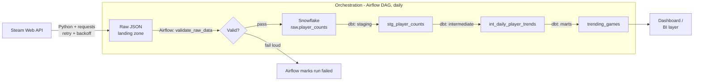

# Gaming Analytics Pipeline

A daily data pipeline that tracks player-count trends across popular Steam games, from raw API ingestion through to analysis-ready warehouse tables. Built to demonstrate orchestration, data modeling, and data quality practices — the batch/warehouse side of the data engineering stack, as a companion to a separate real-time streaming project.

## Why this project

Most "portfolio ETL" projects stop at "pull an API into a CSV." This one is built the way a real pipeline is built: an immutable raw layer, validation before anything touches the warehouse, layered dbt models with tests, and CI that runs those tests automatically on every push.

## Architecture



**Design decisions worth calling out:**

- **Raw layer is immutable JSON, not a direct table write.** If a transform bug is discovered later, you can replay against the exact historical payload instead of having lost the source data.
- **Validation is a separate DAG task, not folded into ingestion.** This makes failures visible and attributable — you know exactly which stage broke.
- **dbt models are layered (staging → intermediate → marts).** Staging only cleans/types raw fields. Intermediate does aggregation. Marts are what the dashboard actually queries. Each layer has a single responsibility, which makes debugging a bad number far faster than tracing through one giant SQL file.
- **Ingestion fails loudly on total failure**, not silently. If every API call fails, the script raises instead of writing an empty "success" file — this is what makes Airflow retries actually meaningful.

## Stack

Python · Apache Airflow · Snowflake · dbt · GitHub Actions (CI)

## Project structure

```
gaming-analytics-pipeline/
├── src/ingestion/steam_api.py       # API extraction with retry logic
├── dags/steam_analytics_dag.py      # Airflow DAG: ingest → validate → load → dbt run → dbt test
├── dbt/gaming_analytics/
│   ├── models/staging/              # 1:1 with raw source, typed and cleaned
│   ├── models/intermediate/         # daily aggregation
│   └── models/marts/                # dashboard-ready tables
├── tests/                           # unit tests for ingestion logic (mocked, no live calls)
└── .github/workflows/dbt_ci.yml     # runs dbt tests on every push
```

## Running it locally

1. **Install dependencies**
   ```bash
   pip install -r requirements.txt
   ```

2. **Set environment variables** — copy `.env.example` to `.env` and fill in:
   - `STEAM_API_KEY` (only needed for endpoints beyond current-player-count)
   - Snowflake credentials

3. **Run ingestion directly**
   ```bash
   python src/ingestion/steam_api.py
   ```
   This lands a timestamped JSON file in `data/raw/`.

4. **Set up dbt**
   ```bash
   cp dbt/gaming_analytics/profiles_example.yml ~/.dbt/profiles.yml
   # fill in real Snowflake values via env vars
   cd dbt/gaming_analytics
   dbt deps
   dbt run
   dbt test
   ```

5. **Run the full pipeline via Airflow** — point your Airflow `dags_folder` at this repo's `dags/` directory, or symlink `dags/steam_analytics_dag.py` into your existing Airflow instance.

## Data quality

dbt tests enforce:
- Not-null on all key fields (`app_id`, `player_count`, `fetched_at`, etc.)
- Uniqueness of `(app_id, report_date)` in the final mart — guards against duplicate loads

## Status / next steps

- [ ] Wire up real Snowflake `COPY INTO` load step (currently stubbed in the DAG)
- [ ] Add a Grafana or Streamlit dashboard on top of `trending_games`
- [ ] Expand tracked games list / add genre-level rollups
- [ ] Add esports match data as a second source, joined against player-count trends

## Author

Marwa Elhussieny — Data Engineer
[LinkedIn](https://linkedin.com/in/marwa-elhussieny) · [GitHub](https://github.com/marwaelhussieny)
